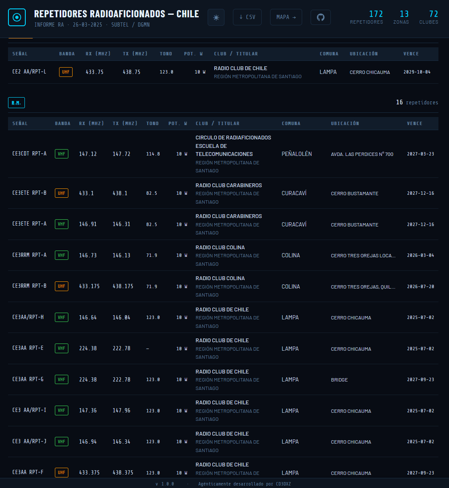

# Radiomap

**Mapa y lista de repetidoras de radioaficionados en Chile** — dónde están, qué cubren y cómo contactar. Datos oficiales SUBTEL/DGMN.

[**→ Abrir la aplicación**](https://www.radiomap.cl/)

---

## Para qué sirve

- **Ver en el mapa** todas las repetidoras, su cobertura teórica y su ubicación.
- **Buscar por señal, comuna, frecuencias (RX/TX/tono)** o filtrar por banda y región.
- **Revisar datos** de cada repetidora (club, potencia, vencimiento) y descargar listas en CSV.

Ideal para planificar rutas, elegir repetidora o tener a mano el listado actualizado.

---

## Cómo se usa

### Mapa de cobertura


- Explora el mapa (modo oscuro/claro).
- Activa círculos de cobertura, solo marcadores o ambos.
- Filtra por banda (VHF/UHF), región o escribe en la búsqueda (señal, comuna, frecuencia…).
- Haz clic en un punto para ver datos completos y nodos cercanos; desde ahí puedes descargar un CSV de nodos cercanos.

### Lista de repetidores



- Tabla por región con señal, banda, RX/TX, tono, potencia, club, comuna y vencimiento.
- Mismos filtros y búsqueda (incluye frecuencias).
- Descarga CSV de la lista completa o de los resultados filtrados.

En ambas vistas puedes cambiar el tema (claro/oscuro) y exportar a CSV desde el menú superior.

---

## Datos

La información proviene del **listado oficial de repetidoras** de la [Subsecretaría de Telecomunicaciones (SUBTEL)](https://www.subtel.gob.cl/), por ejemplo:

- [Listado RAF Repetidoras 29-10-2025](https://www.subtel.gob.cl/wp-content/uploads/2025/10/Listado_RAF_Repetidoras_29_10_2025.xlsx)

Las regiones siguen la división administrativa de Chile (SUBTEL/DGMN).

---

## Ejecutarlo en local

Si quieres correr la app en tu máquina:

```bash
python -m http.server 8080
```

Luego abre `http://localhost:8080/` (mapa) o `http://localhost:8080/lista.html` (lista).  
Usar un servidor local (y no `file://`) ayuda a que el tema y preferencias se guarden bien.

---

*Desarrollado por [CD3DXZ](https://cd3dxz.radio)*
