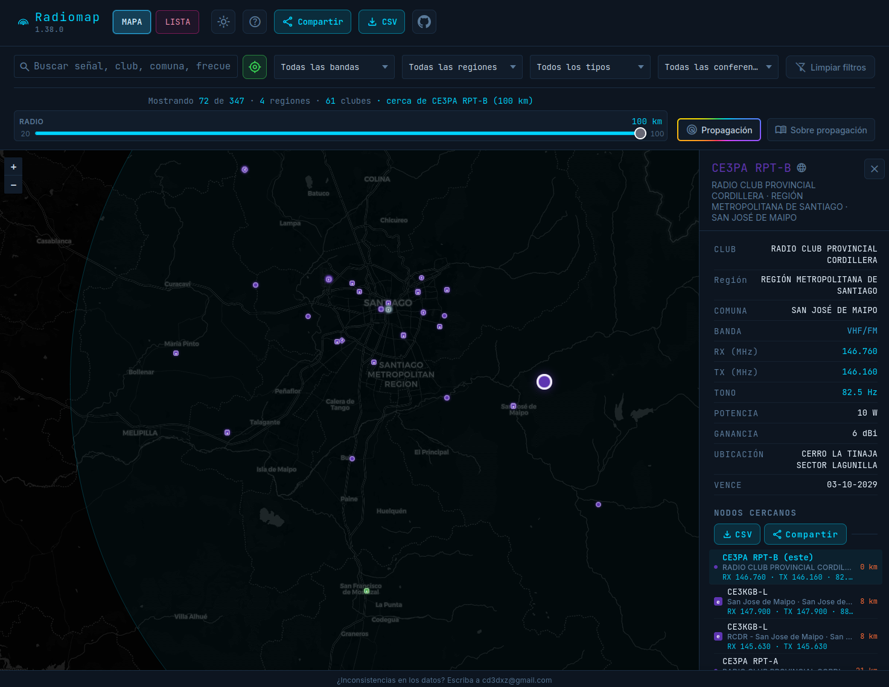
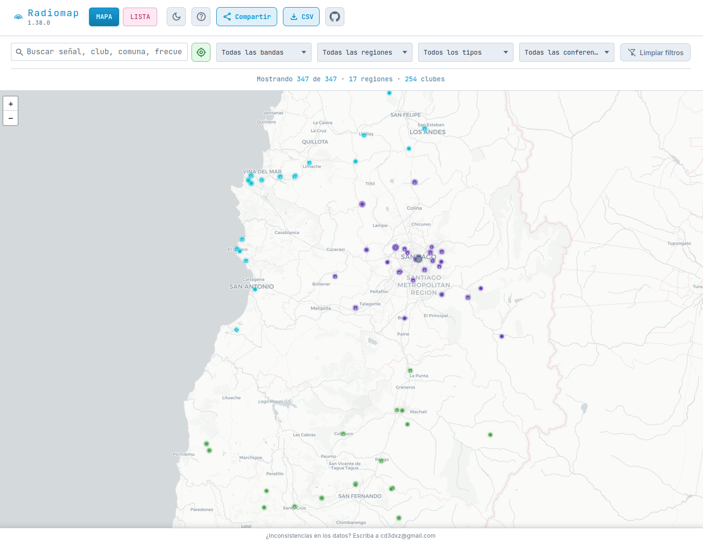
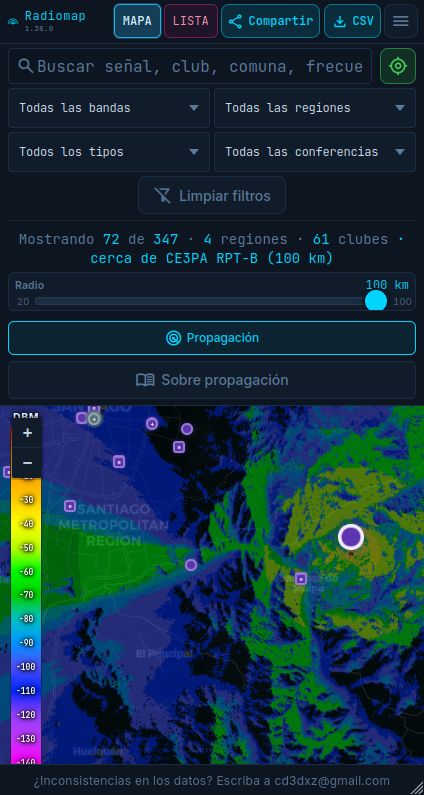

# Radiomap

**El mapa y el listado de repetidoras en Chile** — repetidoras autorizadas, nodos **Echolink** y estaciones **DMR**, en un solo lugar. Pensado para salir a la ruta con la frecuencia correcta y cero fricción.

[**Abrir Radiomap →**](https://www.radiomap.cl/)

---

## Por qué usarlo

- **Una vista del país** — Mapa y tabla por región, con datos alineados al trabajo de SUBTEL/DGMN y curación propia donde hace falta.
- **Encuentra rápido** — Búsqueda por indicativo, comuna, RX/TX, tono, texto en DMR (color, slot, TG) y más.
- **Filtra como operador** — Banda, región, tipo (**radioclubes / Echolink / DMR**) y **conferencia o red** (varias opciones = OR dentro de cada criterio).
- **Cerca tuyo o de una repetidora** — **Cerca de mí** o repetidora de referencia, con **radio ajustable (20–100 km)** para ver solo lo que te sirve en el momento.
- **Llévatelo** — **CSV** en un clic (mapa y lista, también en móvil). **Compartir** genera un enlace con filtros, búsqueda, distancia, posición del mapa y la estación abierta en el panel cuando aplica.
- **Cómodo de noche o de día** — Tema claro/oscuro, ayuda integrada y UI pensada para pantalla chica.

---

## Cómo se ve

### En el navegador (escritorio)

Capturas del **mapa en modo oscuro y claro** — mismo producto, distinto tema; ideal para usar de día o de noche sin cansar la vista.




### En el teléfono

**Mapa** y **lista** optimizados para pantalla chica: controles compactos, navegación MAPA / LISTA y exportación CSV accesible desde el menú.




---

## Mapa

- **Leyenda visual** — Radioclubes (círculo), Echolink (cuadrado **e**), DMR (rombo **d**).
- **Cómo ver la cobertura** — Marcador solo, **círculos orientativos** (radio fijo en el mapa) o ambos; donde hay **mapa de propagación** por estación, activalo desde los controles del mapa (junto al contador de filtros). Explorás Chile con zoom y pan habituales.
- **Propagación (experimental)** — Los mapas raster se generan con el motor [Signal-Server](https://github.com/juantoledo/Signal-Server) y elevación tipo **SRTM** (cita de datos en la página de documentación). Mejoran a medida que se refinan datos de transmisor/antena de los radioclubes, umbrales de la leyenda (dBm/colores) y la configuración del motor. **Documentación completa:** [Sobre propagación](https://www.radiomap.cl/propagacion.html) (también enlazada desde el mapa como «Sobre propagación»).
- **Detalle al tocar** — Ficha con lo esencial y **nodos cercanos**; desde ahí podés exportar CSV de vecinos o compartir la vista.
- La vista es **orientativa**; condiciones reales (terreno, antena, QRM) siempre pueden diferir — revisá el aviso en la app.

---

## Lista

- Tabla **agrupada por región**: señal, banda, RX/TX, tono, potencia, club, comuna, vencimiento e insignias **Echolink/DMR** donde corresponda.
- **Los mismos filtros y la misma búsqueda** que en el mapa, para pasar de vista geográfica a planilla sin perder contexto.

---

## Datos y confianza

La base parte del [**listado oficial de repetidoras de SUBTEL**](https://www.subtel.gob.cl/), complementado con nodos **Echolink** (p. ej. Red Chile, Red Echolink Chile, RCDR) y **DMR** según lo curado en el proyecto. Las regiones siguen la división administrativa chilena. El archivo curado vive en `data/curated_stations.csv`; si encontrás inconsistencias, el flujo del repo permite corregir y regenerar el dataset publicado.

---

## Para desarrolladores

Sitio estático (sin bundler). Para verlo en local:

```bash
./scripts/serve.sh 8080
```

Abrí `http://localhost:8080/` (mapa) o `/lista.html` (lista). **No uses `file://`** si querés tema y preferencias estables.

Tras editar el CSV:

```bash
./scripts/sync-data.sh
```

Más detalle: [`scripts/README.md`](scripts/README.md), [`data/README.md`](data/README.md), [`AGENTS.md`](AGENTS.md).

**Assets de capturas** (README y redes): `images/web-dark.png`, `images/web-light.png`, `images/mobile-map.png`, `images/mobile-list.png`.

---

*Radiomap — desarrollado por [CD3DXZ](https://cd3dxz.radio)*
