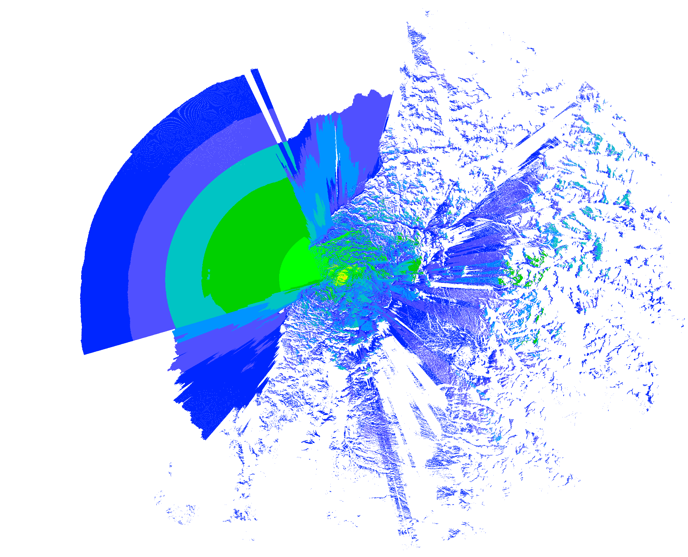

# Signal-Server HD run: `CE2VOL RPT-C`

Manifest generated by `scripts/runsignal-hd-transparent.sh`.

## Coverage preview



PNG with white pixels made transparent (for map overlays). For the raw Signal-Server raster see the `.ppm` in this folder.

## Execution

- **Timestamp:** 2026-03-29T17:53:21-03:00
- **Repository root:** `/home/jtoledoc/dev/Signal-Server2/Signal-Server`
- **Process working directory:** `/home/jtoledoc/dev/Signal-Server2/Signal-Server`
- **signalserverHD binary:** `/home/jtoledoc/dev/Signal-Server2/Signal-Server/build/signalserverHD`
- **Run output directory:** `/home/jtoledoc/dev/Signal-Server2/Signal-Server/output/CE2VOL RPT-C`
- **`OUTPUT_DIR`:** `/home/jtoledoc/dev/Signal-Server2/Signal-Server/output`

### Wrapper invocation

```bash
/home/jtoledoc/dev/Signal-Server2/Signal-Server/scripts/runsignal-hd-transparent.sh --copy-to /home/jtoledoc/dev/radiomap/data/propagation CE2VOL\ RPT-C -dbg -lid data/SRTMGL3.asc -resample 2 -lat -35.7874\, -lon -72.4113 -txh 25 -f 147.36 -m -R 200 -pm 1 -dbm -ant /home/jtoledoc/dev/Signal-Server2/Signal-Server/antenna/generic_omni_2m -rt -110 -txp 10 -txg 6.8 
```

### signalserverHD (final `-o` is appended by the wrapper)

```bash
/home/jtoledoc/dev/Signal-Server2/Signal-Server/build/signalserverHD -dbg -lid data/SRTMGL3.asc -resample 2 -lat -35.7874\, -lon -72.4113 -txh 25 -f 147.36 -m -R 200 -pm 1 -dbm -ant /home/jtoledoc/dev/Signal-Server2/Signal-Server/antenna/generic_omni_2m -rt -110 -txp 10 -txg 6.8 -o /home/jtoledoc/dev/Signal-Server2/Signal-Server/output/CE2VOL\ RPT-C/CE2VOL\ RPT-C 
```

### PNG conversion (white → transparent)

```bash
convert /home/jtoledoc/dev/Signal-Server2/Signal-Server/output/CE2VOL\ RPT-C/CE2VOL\ RPT-C.ppm -transparent white -channel Alpha PNG32:/home/jtoledoc/dev/Signal-Server2/Signal-Server/output/CE2VOL\ RPT-C/CE2VOL\ RPT-C.png 
```

### Copy (`--copy-to`)

- **Destination parent:** `/home/jtoledoc/dev/radiomap/data/propagation`
- **Copied path:** `/home/jtoledoc/dev/radiomap/data/propagation/CE2VOL RPT-C/`

```bash
mkdir -p /home/jtoledoc/dev/radiomap/data/propagation && rm -rf /home/jtoledoc/dev/radiomap/data/propagation/CE2VOL\ RPT-C && cp -a /home/jtoledoc/dev/Signal-Server2/Signal-Server/output/CE2VOL\ RPT-C /home/jtoledoc/dev/radiomap/data/propagation/
```

## Output files

| File | Description |
|------|-------------|
| `CE2VOL RPT-C.dcf` | dBm color palette: threshold lines and RGB colors used when plotting with `-dbm`. |
| `CE2VOL RPT-C.pgw` | World file (Esri): pixel size and map origin to georeference the raster in WGS-84. |
| `CE2VOL RPT-C.png` | PNG derived from the PPM via ImageMagick; white pixels set transparent for map overlays. |
| `CE2VOL RPT-C.ppm` | Portable pixmap from Signal-Server; coverage map (colors encode signal per palette). |
| `CE2VOL RPT-C.prj` | CRS text (WGS 84); pair with .pgw for GIS (QGIS, ArcGIS, etc.). |
| `README.md` | This manifest: how the run was invoked and what each file is for. |

## Parameter reference

Interpret flags using `/home/jtoledoc/dev/Signal-Server2/Signal-Server/README.md` (or `signalserverHD -h`). Common options:

| Flag | Role |
|------|------|
| `-sdf` | Directory of SPLAT `.sdf` terrain tiles |
| `-lat` / `-lon` | Transmitter (decimal degrees) |
| `-f` | Frequency (MHz) |
| `-erp` | ERP (W); with `-dbm`, plot received power |
| `-txp` / `-txg` | Optional split: power at antenna (W) + gain (dB); use `-txgref dbi` or `dbd` |
| `-txh` / `-rxh` | Tx / Rx height AGL |
| `-R` | Coverage radius (miles or km with `-m`) |
| `-pm` | Propagation model (1=ITM, 2=LOS, 3=Hata, …) |
| `-dbm` | Color map by received dBm (use with `.dcf` palette) |
| `-color` | Basename for `.scf` / `.lcf` / `.dcf` palettes |
| `-ant` | Antenna pattern basename (`.az` / `.el`) |
| `-rot` | Azimuth rotation of directional pattern (degrees, clockwise from north) |
| `-m` | Metric units |

Propagation models `-pm`: 1 ITM, 2 LOS, 3 Hata, 4 ECC-33, 5 SUI, 6 COST-Hata, 7 FSPL, 8 ITWOM, 9 Ericsson, 10 Plane earth, 11 Egli, 12 Soil.

